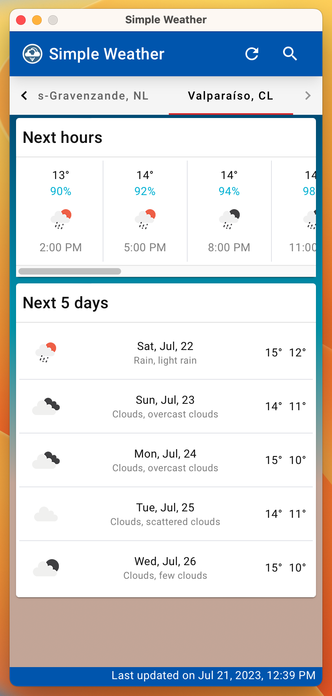

<div align="center">
  <a href="https://github.com/agallardol/simple-weather">
    
  </a>

  <h3 align="center">Simple Weather</h3>

  <p align="center">
    A simple app to check the weather. It was created to learn and test Tauri+Angular+Elf+Tailwind!
    <br />
    <a href="https://www.linkedin.com/in/agallardol/">Getting in touch</a>
    <br />
    <a href="https://raw.githubusercontent.com/agallardol/simple-weather/main/readme-assets/Simple weather.zip"><strong>Download (Macos)</strong></a>
  </p>
</div>


<!-- TABLE OF CONTENTS -->
<details>
  <summary>Table of Contents</summary>
  <ol>
    <li>
      <a href="#about-the-project">About The Project</a>
      <ul>
        <li><a href="#built-with">Built With</a></li>
      </ul>
    </li>
    <li>
      <a href="#getting-started">Getting Started</a>
    </li>
    <li><a href="#contact">Contact</a></li>
  </ol>
</details>


<!-- ABOUT THE PROJECT -->
## About The Project

Simple Weather is a simple app to check the weather. It was made for Desktop and created to learn, practice and test different frameworks and architectures keeping in mind reactivity, datacentrism and portability.

This is a solo-dev showcase work made in just a few hours so you can expect unstability and bugs.

<div align="center">
  
</div>

<p align="right">(<a href="#readme-top">back to top</a>)</p>


### Built With

* [Tauri](https://tauri.app/): Native apps made with Rust, Typescript and Web technologies.
* [Angular](https://angular.io/): Framework to implement the UI.
* [Elf](https://ngneat.github.io/elf/): Framework to implement State Management and Persistence.
* [Tailwindcss](https://tailwindcss.com/): CSS Framework to implement the UI.

Of course, there are a lot of additional technologies but these are the core of this application!

<p align="right">(<a href="#readme-top">back to top</a>)</p>


<!-- GETTING STARTED -->
## Getting Started

To run and work with this app you will need NVM, Node, NPM and Yarn. Having these tools you can just execute:

```sh
yarn
```
```sh
yarn tauri dev
```

and you will have the app runing in dev mode with all the hot-reload tooling.


<p align="right">(<a href="#readme-top">back to top</a>)</p>


<!-- CONTACT -->
## Contact

Found me as [@agallardol](https://www.linkedin.com/in/agallardol/) on LinkedIn.

<p align="right">(<a href="#readme-top">back to top</a>)</p>

